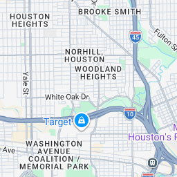
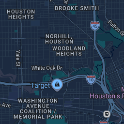
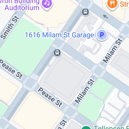
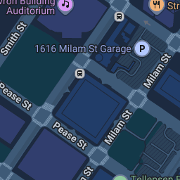

# Feasibility: native dark mode for Google Maps web, via a browser extension

**Date:** 2026-08-07
**Question:** Google Search renders a dark map (pic1); google.com/maps does not (pic2).
Can an extension give Maps the same dark cartography?
**Answer: Yes — and not with a filter hack. Google's own tile server will serve the dark
style to an unauthenticated request on the exact endpoint Maps already uses.**

> **PARTIALLY SUPERSEDED, same day — read [§6](#6-correction-the-tile-rewrite-is-not-the-lever) before
> acting on this document.** Everything measured below is accurate, but the conclusion drawn from it
> was incomplete. Rewriting tile URLs darkens the map for about a second and is then overpainted.
> The lever that actually works is a different asset on a different origin.

---

## 1. The headline finding

Google Maps' 2D base map is fetched as **raster PNG tiles** from a same-origin endpoint:

```
https://www.google.com/maps/vt/pb=!1m4!1m3!1i{z}!2i{x}!3i{y}!2m3!1e0!2sm!3i{ver}!3m8!2sen!3sus!5e1105!12m4!1e68!2m2!1sset!2sRoadmap!4e0!5m1!1e0!23i{exp}…
                                                                                                              ^^^^^^^^^^^^^^^^^^^
                                                                                                              style selector
```

The `!12m4!1e68!2m2!1sset!2s<StyleName>` group is a **server-side style selector**.
Substituting `Roadmap` → **`RoadmapDark`** returns a valid, fully-styled dark tile.

Measured, same tile coordinate (z10/240/423), same session:

| `set:` value   | HTTP | Bytes  | Mean RGB        | Verdict                 |
|----------------|------|--------|-----------------|-------------------------|
| `Roadmap`      | 200  | 29 750 | (218, 228, 229) | light map (baseline)    |
| **`RoadmapDark`** | 200 | **27 275** | **(38, 57, 77)** | **dark map — valid**  |
| `Dark`, `dark`, `Night`, `night`, `DarkMode`, `Dark_Mode`, `DarkRoadmap`, `Dusk`, `Nightmode`, `MapsDark`, `roadmap_dark`, `DarkMaps`, `Satellite`, `Transit`, `Bicycling` | 200 | 178 | (255, 255, 0) | Google's yellow "invalid style" error tile |

`RoadmapDark` is the only working dark token found in an 18-name sweep. The 178-byte
yellow tile is the tell for a rejected style name — use it as the runtime health check.

**Reference point:** the dark map image in Google Search's knowledge panel
(`/maps/vt/data=<signed token>`, 260×312 PNG) has mean RGB **(28, 47, 63)**. Same
palette family. `RoadmapDark` *is* the Search dark cartography.

### Visual evidence (committed under `docs/evidence/`)

| z13 Houston, `Roadmap` | z13 Houston, `RoadmapDark` |
|---|---|
|  |  |

| z17 downtown, `Roadmap` | z17 downtown, `RoadmapDark` |
|---|---|
|  |  |

Labels, road shields, park fills, water, building footprints and POI icons are **all
baked into the raster tile**. There is no separate light-coloured label pass to fight.
One URL rewrite yields a complete, native-looking dark base map.

### No authentication required

The dark tiles above were fetched from PowerShell with `Invoke-WebRequest`, a plain
browser UA, **no cookies, no API key, no signed token**. The style selector is not
session-bound.

---

## 2. How Google Maps web actually renders (why the obvious approaches are wrong)

Observed on `https://www.google.com/maps/@29.76,-95.37,10z` (Chromium, 1440×900):

- A WASM module `\/maps\/_\/wa\/w.<hash>.mapcore.O.wasm` is loaded; telemetry beacons
  name two workers, `worker_mc0` (mapcore) and `worker_mcl0` (mapcore labeler).
- The map lives in `div.D21QYe` holding **two full-viewport stacked `<canvas>` elements**.
  Probing one of them returns:
  `Cannot get context from a canvas that has transferred its control to offscreen.`
  → **the map is rendered by WebGL inside a Web Worker via `OffscreenCanvas`.**
- `crossOriginIsolated: false`, no `SharedArrayBuffer`.
- Base map tiles requested at load: **28 raster tiles at z10, 24 at z17** — the same
  `!2sRoadmap` endpoint at both zooms. The only other tile shape seen is
  `!4i128!2m2!1e1` (128 px imagery thumbnails — Layers button / Pegman), 6 of them.

Consequences:

| Approach | Verdict |
|---|---|
| Patch `WebGLRenderingContext.prototype.shaderSource` from a content script | **Dead.** The GL context lives in a worker; a page-world hook never sees it. |
| Patch `window.fetch` / `XHR` / `Image.src` from a content script | **Unreliable.** Some tile loads are main-thread, but the renderer is worker-driven; you would have to also patch the worker (blob-URL bootstrapped). |
| `declarativeNetRequest` / `webRequest` URL rewrite | **Correct.** Operates below the thread boundary — catches page, worker and WASM-originated requests identically. |
| CSS `filter: invert(1) hue-rotate(180deg)` on `div.D21QYe` | Works mechanically (verified: the filter applies and the map keeps compositing) but produces approximated colours, inverts POI photos and icons, and is visibly *not* Google's dark map. **Fallback only.** |

---

## 3. Does Maps have a native dark mode we could just switch on?

No. Loaded with the browser preferring dark (`prefers-color-scheme: dark` = `true`):

- Exactly **1** `@media (prefers-color-scheme: dark)` block across all 8 stylesheets.
- No `<meta name="color-scheme">`.
- Menu inventory contains no Appearance/Theme item
  (`Search, Directions, Next page, Menu, Close, Show Your Location, Zoom in, Zoom out,
  Browse Street View images, Show imagery, …`).
- No dark-related keys in `localStorage` / `sessionStorage` / cookies.

So the **app chrome** (side panel, search box, place cards, buttons) has no dark theme to
enable. That half of the job is bespoke CSS the extension must author. Only the *map
surface* gets Google-authored dark styling for free.

---

## 4. What is proven vs. what is not

**Proven, with artifacts:**
- `set:RoadmapDark` returns genuine Google dark cartography, unauthenticated, at z10/z13/z17.
- Maps' 2D base map at initial render comes entirely from that styleable endpoint.
- Maps' map surface is an OffscreenCanvas driven from a worker.
- Maps ships no native dark theme.

**Not proven — this is the first thing the build must gate on:**
- That **pan/zoom-time** tiles also travel over `/maps/vt/pb=…!2sRoadmap!…`. The test
  environment could not deliver real pointer gestures (synthetic `wheel`/`mousedown` and
  programmatic `.click()` on the zoom button did not move the map; screenshots were
  unavailable), so only initial-render traffic was observed. If the WASM renderer switches
  to a different data path once warm, the tile-rewrite plan degrades to the CSS-filter
  fallback. **This is milestone M0's exit gate.**
- Behaviour of satellite / terrain / transit / traffic layers under the rewrite.
- Whether the Maps service worker (`sw_initialize` observed) caches light tiles and would
  serve them past the rewrite.

**Known hazard:** `RoadmapDark` is an **undocumented internal token**. Google can rename or
withdraw it at any time with no notice and no deprecation. The extension must probe it at
startup and degrade gracefully, never render a yellow error tile to the user.

---

## 5. Method

All measurements taken 2026-08-07 against live `www.google.com`, Chromium 1440×900 and
1100×700, `prefers-color-scheme: dark`. Tile bytes and mean RGB computed by decoding each
PNG to an `OffscreenCanvas` and sampling every 37th–97th pixel. Style-name sweep issued as
same-origin `fetch()` from the Maps page itself. Independent unauthenticated confirmation
via `Invoke-WebRequest` with no cookie jar.

Reproduce the core finding in one line:

```bash
curl -s -o dark.png "https://www.google.com/maps/vt/pb=!1m4!1m3!1i13!2i1925!3i3385!2m3!1e0!2sm!3i789555512!3m8!2sen!3sus!5e1105!12m4!1e68!2m2!1sset!2sRoadmapDark!4e0!5m1!1e0" && ls -l dark.png
```

A file of ~20 KB is a real dark tile; 178 bytes means the token stopped working.

---

## 6. Correction: the tile rewrite is not the lever

Written the same day, after building the extension and driving it against live Maps.

### What §1–§5 got right, and what it got wrong

Right: the dark tiles are real, unauthenticated, and Google's own. Wrong: the assumption that the
raster tile endpoint is *the* base-map transport. It is one of several, and it is not the one that
paints the settled map in most sessions.

### There are three renderer modes, not one

Maps picks a renderer client-side by capability probe. Measured over 67 trials:

| Mode | When | Base map arrives via | Palette source |
|---|---|---|---|
| `mapcore` (WebGL + WASM) | stock headed Chromium, 35/36 navigations | `/maps/vt/proto?bpb=<protobuf>` | gstatic `CompactLegend` asset |
| `canvas+labeler` | Firefox, 6/6 | raster `/maps/vt/pb=` + `/maps/vt/stream/pb=…!4e1` | gstatic `CompactLegend` asset |
| `canvas` | WebGL denied, headless, old UA | raster + stream | server, via `!1sset!2s` on the **stream** URL |

The ~24 raster tiles at ~275 ms appear in **all three** modes — they are the server-HTML first-paint
grid. Counting raster tiles cannot tell you which mode you are in. That is what misled §1.

Ruled out as the selector, with evidence: the `!23i` experiment-ID set (21 distinct IDs over 67
trials, **zero** arm-exclusive), the `g_ep` parameter (byte-identical across modes in all trials),
and cookies (mode decided with an empty jar; 12/12 re-navigations never changed it).

### Rewriting tiles darkens the map for one second

With every raster tile rewritten to `RoadmapDark`, the map is genuinely dark at 500 ms and light
from ~1400 ms onward, permanently. `test/artifacts/extension-firstpaint-500ms.png` is a complete,
correct dark Google map; `control-firstpaint-500ms.png` is the same viewport at the same instant,
light. The raster layer is not a placeholder sketch — it is a complete map that Maps then discards.

The proto transport carries the identical `set:Roadmap` selector as binary protobuf
(`62 12 | 08 44 | 12 0e | 0a 03 "set" | 12 07 "Roadmap"`), but **no regex can rewrite it**:
`Roadmap`(7) → `RoadmapDark`(11) requires incrementing three nested length prefixes and
re-encoding base64, and `regexSubstitution` has no arithmetic.

### The actual lever

The vector renderer's palette is a **static, unauthenticated, style-name-keyed asset on a different
origin**:

```
https://www.gstatic.com/maps/res/CompactLegend-Roadmap-<32-hex-version>
```

Swapping `Roadmap` → `RoadmapDark` is a pure string substitution. Verified live, two version hashes,
independently re-fetched:

| Style | 4311471e…3ba | e3dec3f8…7f4 |
|---|---|---|
| `Roadmap` | 200, 2 056 525 B | 200, 2 072 796 B |
| `RoadmapDark` | 200, 1 938 292 B | 200, 1 954 715 B |
| `Terrain` | 200, 2 023 776 B | 200, 2 040 047 B |
| `TerrainDark` | 200, 1 907 717 B | 200, 1 924 139 B |
| `Satellite`, `NotAStyle` | 404 | 404 |

The clean 404 on invalid names is a better health canary than the 178-byte yellow tile. Version
hashes rotate — two were observed in a single day — so never pin one.

With one DNR rule doing this swap, the WebGL vector map renders in Google's genuine dark
cartography, with every control, label and POI intact. Measured map-area mean RGB **(36.06, 54.15,
76.30)** against a light baseline of **(223.40, 231.14, 229.66)**, across 5 fresh profiles, 5/5.

### And it survives interaction

The open question from §4 — does darkness *survive* — is now answered. Driving real trusted-input
pan, wheel-zoom across 4+ zoom levels, a layer toggle, a search and an opened place card:
**Chrome 33/33 luminance samples dark over 140 s; Firefox 33/33 over 100 s.** Zero light, zero
degenerate. Both mutation controls fail every positive assertion.

### Also ruled out, so nobody retries them

Blocking `/maps/vt/proto` or the mapcore WASM *does* pin Maps to the raster path and the map stays
dark — but the app never mounts: 5 accessible controls versus 22, no attribution bar, empty search
results. The raster fallback only engages when the vector transport is dead from the first request,
and that same bootstrap failure is what stops the app initialising. Also dead: `?force=lite`,
`?output=classic`, deleting `OffscreenCanvas`, and denying WebGL (works, but the resulting `canvas`
mode takes colour from the stream, not the legend).
